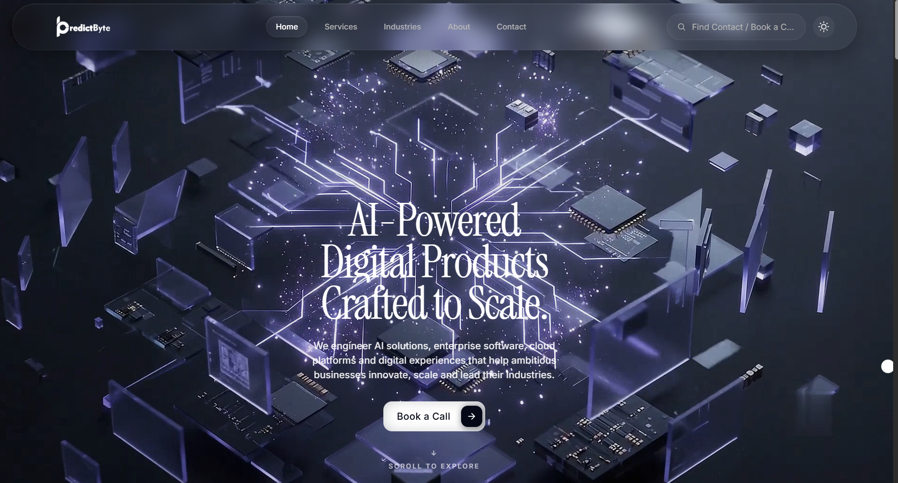
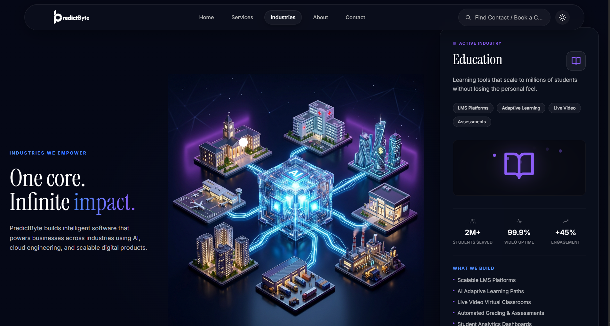
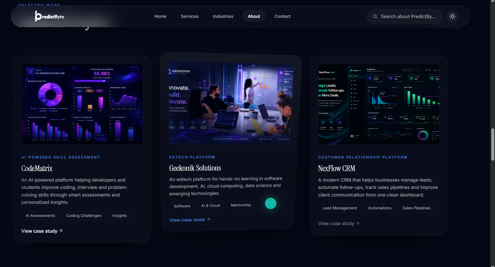

Company Website

A modern, responsive business website showcasing services, industries served, our workflow, and project portfolio.

🚀 Features

Clean, professional homepage
Detailed services overview
Industries we serve
Step-by-step process breakdown
Project showcase/portfolio

📸 Screenshots

Homepage

Services

Industries

Our Process

Projects

🛠️ Tech Stack

HTML5 / CSS3 / JavaScript
(update with your actual stack, e.g. React, Next.js, Tailwind CSS, etc.)

📦 Installation

bash# Clone the repository
git clone https://github.com/your-username/your-repo-name.git

# Navigate into the project directory
cd your-repo-name

# Install dependencies
npm install

# Run the development server
npm run dev

🤝 Contributing

Contributions, issues, and feature requests are welcome. Feel free to check the issues page.

📄 License
